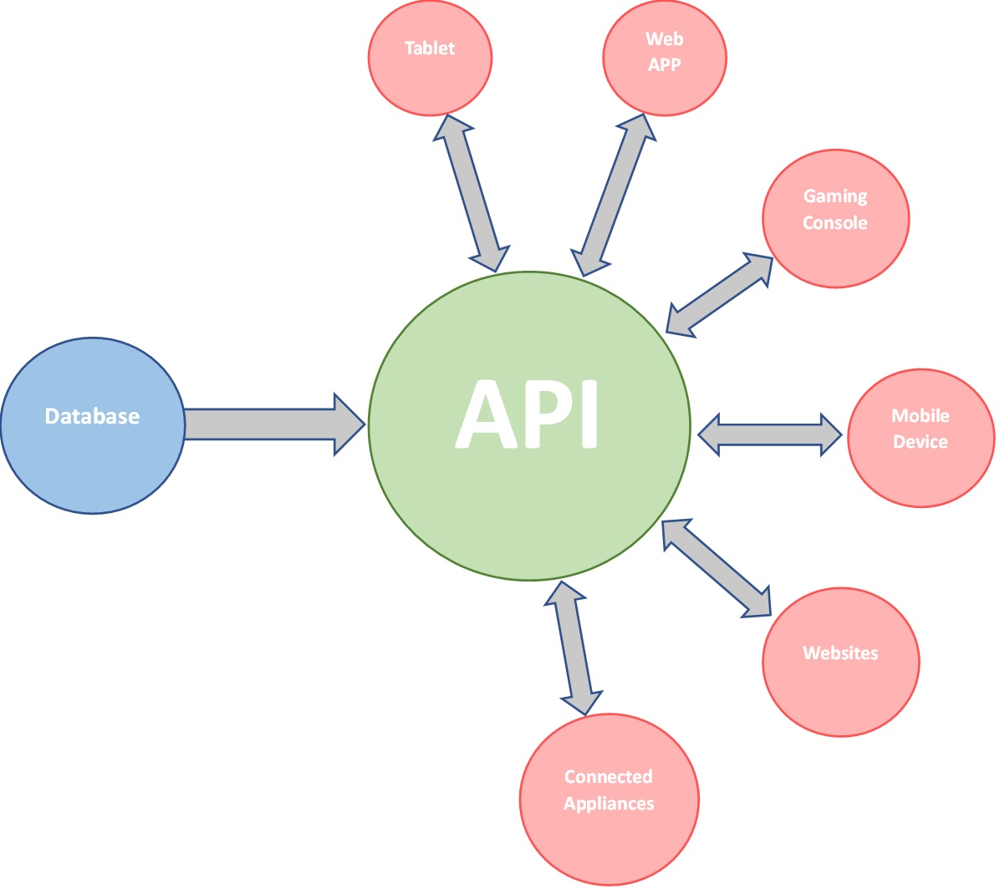

# What are API's?

API stands for Application Programming Interface.
An application programming interface is a way for two or more computer programs to communicate with each other.
In simple terms, an API acts as a messenger that takes requests from one application and communicates with another application. This allows different software applications to talk to each other, share data, and perform various functions without the need for direct communication between them.

# A simple diagram of how an API operates:

# What is a REST API?
RESTful API is an interface that two computer systems use to exchange information securely over the internet. Most business applications have to communicate with other internal and third-party applications to perform various tasks. For example, to generate monthly payslips, your internal accounts system has to share data with your customer's banking system to automate invoicing and communicate with an internal timesheet application.
RESTful APIs support this information exchange because they follow secure, reliable, and efficient software communication standards.

# What is HTTP?
The Hypertext Transfer Protocol (HTTP) is the foundation of the World Wide Web, and is used to load webpages using hypertext links. HTTP is an application layer protocol designed to transfer information between networked devices and runs on top of other layers of the network protocol stack.
A typical flow over HTTP involves a client machine making a request to a server, which then sends a response message.

# HTTP Request Structure Diagram:

HTTP Response
HTTP Response sent by a server to the client. The response is used to provide the client with the resource it requested. It is also used to inform the client that the action requested has been carried out. It can also inform the client that an error occurred in processing its request.

An HTTP response contains the following things:

- Status Line
- Response Header Fields or a series of HTTP headers
- Message Body
- In the request message, each HTTP header is followed by a carriage returns line feed (CRLF). After the last of the HTTP headers, an additional CRLF is used and then begins the message body.

In the response message, the status line is the first line. The status line contains three items:
- The HTTP version number, showing the HTTP specification to which the server has tried to make the message comply.
- A status code, which is a three-digit number indicating the result of the request.
- A reason phrase, also known as status text, which is human-readable text that summarizes the meaning of the status code.

HTTP headers:

The HTTP headers for a server's response contain information that a client can use to find out more about the response, and about the server that sent it. This information can assist the client with displaying the response to a user, with storing (or caching) the response for future use, and with making further requests to the server now or in the future

Message body:

The message body of a response may be referred to for convenience as a response body.
Message bodies are used for most responses. The exceptions are where a server is responding to a client request that used the HEAD method (which asks for the headers but not the body of the response), and where a server is using certain status codes.
For a response to a successful request, the message body contains either the resource requested by the client, or some information about the status of the action requested by the client. For a response to an unsuccessful request, the message body might provide further information about the reasons for the error, or about some action the client needs to take to complete the request successfully.

# What are the 5 HTTP verbs?
The HTTP protocol supports several HTTP verbs:

- GET - The GET method is used to retrieve data from a server. When a client sends a GET request to a server, the server retrieves the requested resource and returns it to the client in the response body. GET requests should be used for read-only operations and should not modify any data on the server.

- POST - The POST method is used to submit data to a server to create a new resource. When a client sends a POST request to a server, the server creates a new resource based on the data in the request body and returns a response that includes the URL of the newly created resource.

- PUT - The PUT method is used to update an existing resource on the server. When a client sends a PUT request to a server, the server replaces the existing resource with the data in the request body. If the resource does not exist, the server may create a new resource with the specified data.

- DELETE - The DELETE method is used to delete a resource from the server. When a client sends a DELETE request to a server, the server deletes the specified resource.

- PATCH - The PATCH method is used to modify an existing resource on the server. When a client sends a PATCH request to a server, the server updates the existing resource with the data in the request body. Unlike the PUT method, which replaces the entire resource, the PATCH method only modifies the specified fields in the resource.

# What is Statelessness?

In HTTP, statelessness refers to the property of the protocol where each request and response between a client and a server is independent of any previous requests and responses. 
In other words, the server does not store any information about the client between requests.
This means that each request that a client sends to a server must contain all the information necessary for the server to understand and fulfill the request.
The server responds to each request independently, without any knowledge of previous requests or context from the client.
This allows the server to scale and handle a large number of requests from multiple clients simultaneously without any issues related to shared state.

# What is Caching?
In HTTP, Caching refers to the process of storing frequently accessed data on the client or server side to improve performance and reduce network traffic.
Caching can help to reduce the amount of time and bandwidth needed to retrieve data from a server, as the client can access the cached data instead of making a new request to the server.
This can significantly improve the performance of web applications, especially for resources that are accessed frequently and change infrequently, such as images, scripts, and stylesheets.
